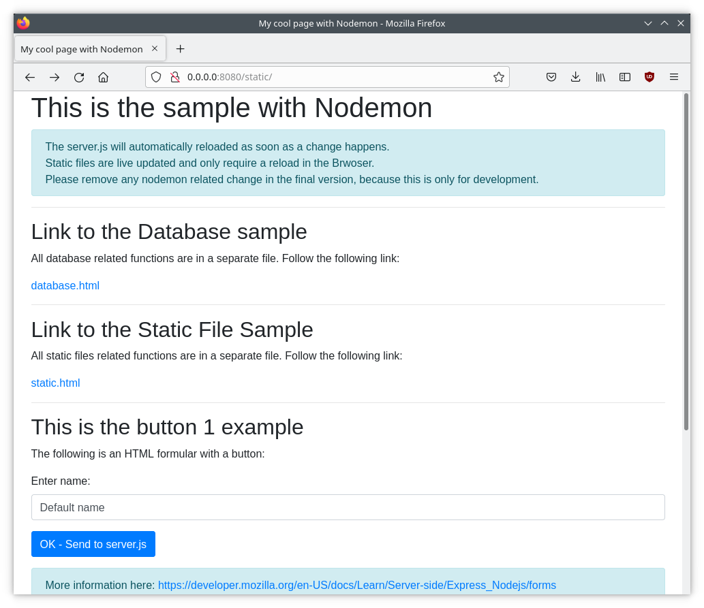

# Client - (Web-)Server Extended mit einer Datenbank in Node.js mit nodemon

## Allgemein

Dies ist dasselbe Beispiel wie `node-client-server-extendet-with-database`, nur dass in diesem Fall noch nodemon verwendet wird. Dieses Tool ermöglicht für die Entwicklung ein Live-Update und automatischen Neustart des Node.js Servers für eine schnellere Entwicklung.

Bitte schaue zuerst das Beispiel `node-client-server-extended-with-database` an: [- node-client-server-extended-with-database Beispiel ->](../node-client-server-extended-with-database/README.md)

In dieser Anleitung wird nur auf alle Erweiterungen des Extended-Beispiels der Datenbank eingegangen.



### Nodemon

Damit das Live-Update automatisch funktioniert, muss zuerst in dem `server`-Verzeichnis `npm install` ausgeführt werden.

Das Verzeichnis `server` wird in den Container direkt übergeben. Somit wird das lokale Verzeichnis im Container durch den sogenannten `mount` zur Verfügung gestellt.
Dies bedeutet, dass das Löschen, Anlegen oder Ändern von Dateien bzw. Verzeichnissen im Server auch im Host durchgeführt werden.

`nodemon` erkennt jegliche Änderung an den Dateien und startet den Server automatisch neu. Danach muss jedoch die Seite im Browser neu geladen werden.


**Wichtig:** `nodemon` ist ein Development Tool und das sollte für die Abgabe entfernt werden.

1. Verzeichnismount: <todo>
2. Löschen des Überschreibens durch command <todo>
3. Entfernen der nodemon dependency


### Static Files

Da das Verzeichnis vom Host eingebunden wird, werden Änderungen an den `Static Files` automatisch angewendet und können durch eine einfache Aktualisierung im Browser direkt angezeigt werden (`F5`).


## Installation und Ausführung

**Hinweis:** Beachte, dass die `docker-compose.yml` im Hauptverzeichnis des Projektes liegt. Die Ordnerstruktur enthält einen Ordner `client` und einen Ordner `server`, welche jeweils die benötigten Dateien sowie eine eigene `Dockerfile` haben, welche die Container beschreiben. Die Container sind unabhängig und unterscheiden sich. Innerhalb der `docker-compose.yml` wird unter `build` der Ordner angegeben, welcher die `Dockerfile` beinhaltet.

In den Verzeichnisen `server` müssen vor dem ersten Start mittels:
```sh
npm install
```
alle definierten Bibliotheken im `package.js` heruntergeladen werden. Sonst kann der Container nicht gestartet werden.

**Hinweis:** nodemon muss nicht lokal installiert werden. Es reicht vollkommen aus, dass dies nur im Container läuft. Dort wird es in Zeile <todo> installiert.

Danach kann in diesem Ordner folgender Befehl ausgeführt werden:

```sh
# start mit
docker-compose up --build
```

**Hinweis:** Sollte es Probleme geben, muss unter Umständen das `:Z` in der `docker-compose.yaml` entfernt werden (<todo>).

Danach starten alle Container wie gewohnt. Es kann jedoch sein, dass der Server mehrfach abstürzt, da dieser auf die Verfügbarkeit der Datenbank warten muss.

Wenn jetzt eine Änderung auf dem Computer durchgeführt wird, wird diese durch den `Volume-mount` automatisch an den Container weitergegeben und man sieht folgenden Log:

```sh
server_1        | [nodemon] restarting due to changes...
server_1        | [nodemon] starting `node server.js`
```

Dabei wird auch im Log ausgegeben, wenn die `database.sql` geladen wird: `meinecooledb_1  | 2020-04-10 13:38:59+00:00 [Note] [Entrypoint]: /usr/local/bin/docker-entrypoint.sh: running /docker-entrypoint-initdb.d/database.sql`.

Um alle Container zu stoppen, können diese mittels [strg] + [c] beendet werden.

**Hinweis:** Sollte der Container nicht herunterfahren, dann kann [strg] + [c] nochmals gedrückt werden, um dies zu beschleunigen.

Der Output sieht wie folgt aus:
```sh
Gracefully stopping... (press Ctrl+C again to force)
Stopping node-client-server-extended-with-database_server_1       ...
Stopping node-client-server-extended-with-database_phpmyadmin_1   ...
Stopping node-client-server-extended-with-database_meinecooledb_1 ...
# wenn nochmal [strg] + [c] gedrückt wird:
Stopping node-client-server-extended-with-database_server_1       ... done
Stopping node-client-server-extended-with-database_phpmyadmin_1   ... done
Stopping node-client-server-extended-with-database_meinecooledb_1 ... done
```

**Wichtig:** Der Parameter `--build` sorgt dafür, dass bei jedem Aufruf von `docker-compose up` alle Container neu gebaut werden, damit alle Änderungen im `server.js` sowie im Datenbankschema `database.sql` in den jeweiligen Container integriert werden.


## Informationen

 * Nodemon:
   * Homepage: https://nodemon.io/
   * Dokumentation: https://github.com/remy/nodemon#nodemon
 * Express
   * NPM: https://www.npmjs.com/package/express
   * Dokumentation: https://expressjs.com/en/4x/api.html
   * Routing: https://expressjs.com/en/guide/routing.html
   * Getting Started: https://expressjs.com/en/starter/installing.html
 * MariaDB
   * Dockerhub: https://hub.docker.com/_/mariadb/
   * Homepage: https://mariadb.org/
   * Dokumentation: https://mariadb.org/documentation/
 * MySQL-Client
   * NPM: https://www.npmjs.com/package/mysql
   * Repository: https://github.com/mysqljs/mysql
 * Bootstrap (CSS für Table, usw.)
   * Homepage: https://getbootstrap.com/
   * Alerts: https://getbootstrap.com/docs/4.3/components/alerts/
   * Tabelle: https://getbootstrap.com/docs/4.0/content/tables/
   * Buttons: https://getbootstrap.com/docs/4.3/components/buttons/
 * W3Schools:
   * Button onclick Event: https://www.w3schools.com/jsref/event_onclick.asp
   * JSON HTML Table: https://www.w3schools.com/js/js_json_html.asp
   * AJAX: https://www.w3schools.com/xml/ajax_intro.asp
   * Node.js mysql: https://www.w3schools.com/nodejs/nodejs_mysql_where.asp
   * JSON: https://www.w3schools.com/js/js_json.asp
